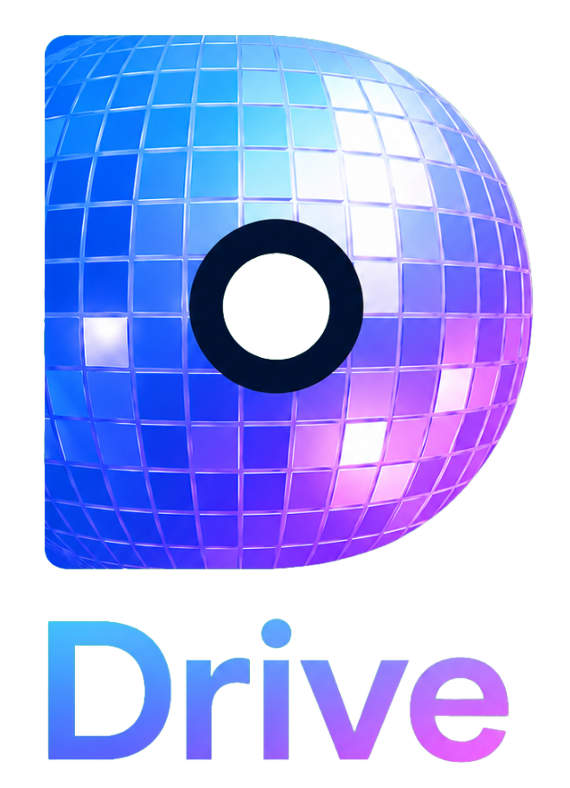

<p align="center">
  
</p>

# DiscoDrive Apps

[English](../README.md) · [Deutsch](README.de.md) · [Українська](README.uk.md) · [**Français**](README.fr.md) · [Español](README.es.md) · [Русский](README.ru.md) · [Српски](README.sr.md)

**Les applis clientes DiscoDrive — pour tous vos appareils.** Un démon de synchronisation en arrière-plan, un client de bureau et des applis mobiles natives dans un seul dépôt.

Ceci est le dépôt des clients pour le [serveur DiscoDrive](https://github.com/kosmosoid/discodrive) — votre cloud personnel pour fichiers, calendriers, contacts, tâches, musique et livres.

Multiplateforme : macOS, Windows, Linux et Android. Un seul `Makefile` construit la bonne variante pour le bon OS.

---

## Fonctionnalités

### 🔄 Démon de synchronisation

Synchronisation bidirectionnelle de dossier en arrière-plan, façon Dropbox : un dossier local ↔ le serveur. Ce qui est synchronisé — un seul dossier ou toute la racine du stockage — se configure **sur le serveur**.

- **Sans interface (headless)** — fonctionne sans interface graphique, idéal pour serveurs et NAS.
- **Barre de menus / zone de notification** (build avec `TRAY=1`) — icône d’état et actions rapides.
- **Coffre E2E** — chiffrement côté client dans un format compatible [Cryptomator](https://cryptomator.org) : les fichiers sont chiffrés sur l’appareil avant d’être envoyés.
- **Aucune perte de données** — si le même fichier change à deux endroits en même temps, une copie de conflit est créée au lieu d’un écrasement silencieux.
- **Démarrage automatique à l’ouverture de session.**

### 🖥️ Client de bureau

Une appli graphique multiplateforme (macOS, Windows, Linux) avec un modèle **à la demande**.

- **Parcourir tout le stockage** — toute l’arborescence des fichiers est visible.
- **Téléverser et télécharger** fichiers et dossiers, gérer les coffres E2E directement dans l’appli.
- **Appairage au serveur** en quelques clics.
- **Zone de notification système** et démarrage automatique.
- **7 langues d’interface** — anglais, allemand, ukrainien, français, espagnol, russe et serbe.

### 📱 Applis mobiles

- **Clients complets** — `android-discodrive` (Android) et `ios` (iOS) : accès à la demande à tout le stockage.
- **Folder-sync** — `android-fastsync` et `ios-fastsync` : applis minimales pour la synchronisation complète d’un dossier choisi.

---

## Builds prêts à l’emploi

Des binaires prêts à l’emploi pour Linux, Windows et macOS (démon et client de bureau) ainsi qu’un `.apk` pour Android sont publiés sur la page des releases :

### 👉 [github.com/kosmosoid/discodrive-apps/releases](https://github.com/kosmosoid/discodrive-apps/releases)

- **macOS** (`.dmg`) et **Windows** (`.exe` + installateur) ne sont **pas signés**. Au premier lancement, Gatekeeper (macOS) ou SmartScreen (Windows) afficheront un avertissement.
- **iOS** n’est pas inclus dans les releases (il faut le compiler soi-même et l’installer sur un iPhone via Xcode).

---

## Compilation depuis les sources

Si les builds prêts à l’emploi ne suffisent pas ou s’il vous faut une autre plateforme — compilez vous-même. `make doctor` indique quels outils sont installés et lesquels manquent.

### Ce qu’il faut

Les commandes et outils ci-dessous supposent **macOS comme système hôte** : le démon se compile de façon croisée sur n’importe quel OS, tandis que le client de bureau se construit sur macOS — un `.dmg` natif plus Windows et Linux en compilation croisée (Windows directement, Linux dans un conteneur Docker). Sur Windows/Linux eux-mêmes, l’ensemble d’outils diffère (voir la note ci-dessous).

**Commun (toute plateforme) :**

- **Go 1.25+** — requis pour tout.
- **Node.js** — pour construire le frontend du client de bureau.
- **Chaîne d’outils du client de bureau** — `go install github.com/wailsapp/wails/v2/cmd/wails@latest`.

**Client de bureau (hôte — macOS) :**

- **makensis** (`brew install makensis`) — installateurs Windows (NSIS), cible `desktop-windows`.
- **Docker** — build Linux dans un conteneur Debian avec WebKitGTK, cible `desktop-linux`.

**Applis mobiles :**

- **Xcode + XcodeGen** — applis Apple (macOS uniquement).
- **Android SDK + NDK + Gradle**, **gomobile** — Android.

> **Compiler hors macOS.** Le démon se compile partout, sans réserve. Le client de bureau pour Linux/Windows peut aussi se compiler nativement — directement via `wails build` avec les dépendances système de la plateforme (sous Linux — paquets de dev GTK 3 et WebKit2GTK ; sous Windows — WebView2) ; il n’y a pas de cibles `make` dédiées pour cela. La cible `desktop-linux` (Docker) fonctionne depuis n’importe quel hôte.

### Démon

```bash
make daemon                       # pour l’OS actuel → dist/<os>-<arch>/discodrive
make daemon OS=linux ARCH=arm64   # compilation croisée (Go pur, sans CGO)
make daemon TRAY=1                # avec barre de menus / zone de notification (CGO)
make daemon-all                   # tous les OS d’un coup
```

### Client de bureau

```bash
make desktop              # appli macOS (universal)
make dmg-desktop-macos    # macOS .dmg                  → dist/DiscoDrive-<version>-macos.dmg
make desktop-windows      # Windows .exe + NSIS         → dist/windows/   (compilation croisée depuis macOS)
make desktop-linux        # Linux (via Docker, tout hôte) → dist/linux/
```

### Applis mobiles

```bash
make app-android            # Android, UI complète
make app-android-fastsync   # Android, folder-sync
make app-macos              # appli macOS (Xcode)
make app-ios                # appli iOS (Xcode)
make bind-ios               # binding gomobile pour Apple uniquement
make bind-android           # binding gomobile pour Android uniquement
```

Les artefacts de build vont dans `dist/`. Liste complète des cibles — `make help`.

---

## Licence & usage commercial

DiscoDrive est **source-available** sous la licence [PolyForm Noncommercial License 1.0.0](../LICENSE).

- ✅ **Gratuit pour tout usage non commercial** — utilisez-le pour vous-même, votre famille, vos loisirs, vos études ou vos expériences. C'est tout l'intérêt.
- ✅ **Modifiez-le comme bon vous semble** — à condition de conserver la mention d'attribution obligatoire.
- ❌ **L'usage commercial n'est pas autorisé.**

Besoin d'un usage commercial ? Une licence commerciale distincte est disponible — écrivez à [discodrive@kosmosoid.dev](mailto:discodrive@kosmosoid.dev).

---

DiscoDrive est un projet non commercial réalisé par une seule personne. Les retours et suggestions sont les bienvenus : [discodrive@kosmosoid.dev](mailto:discodrive@kosmosoid.dev).
